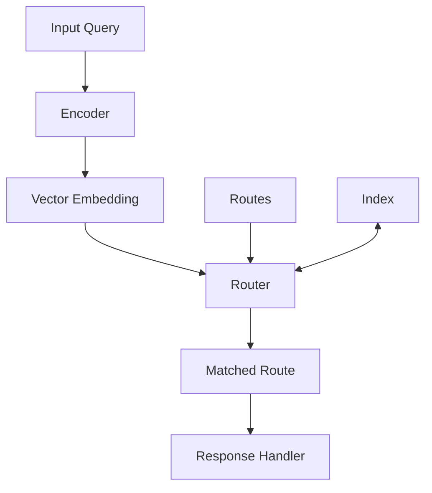
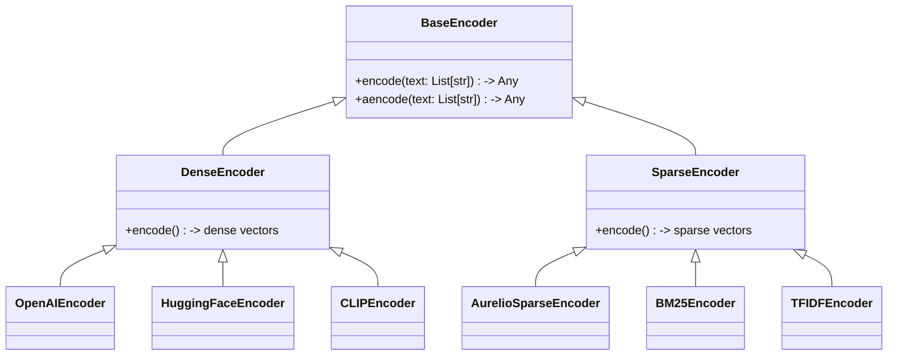
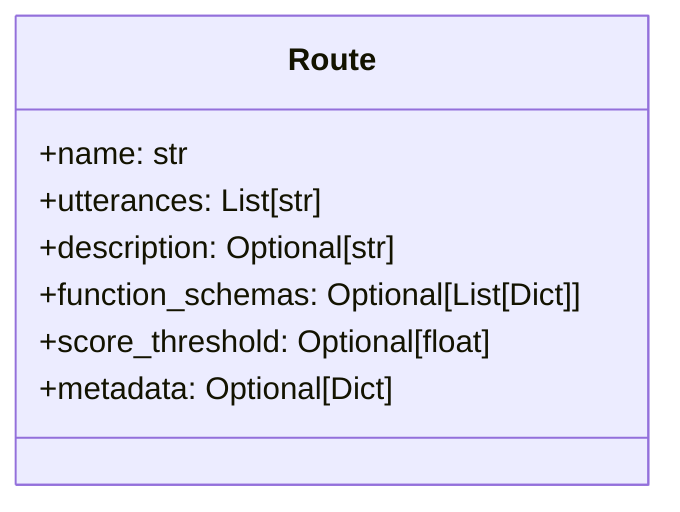
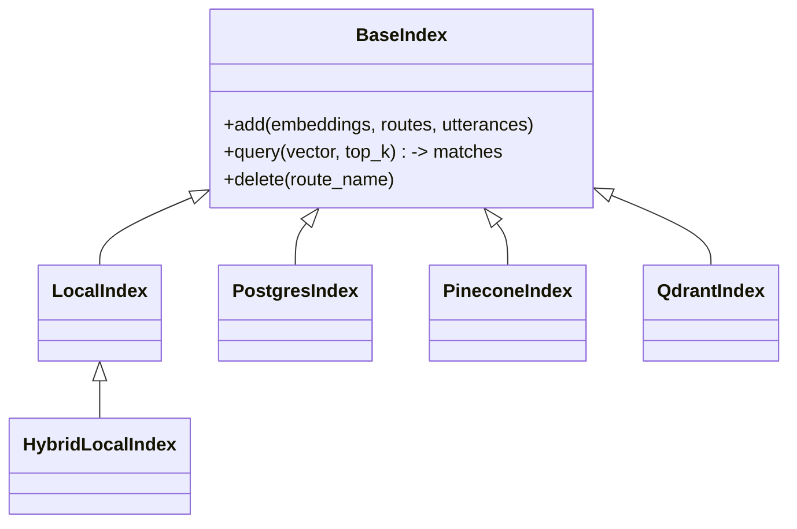
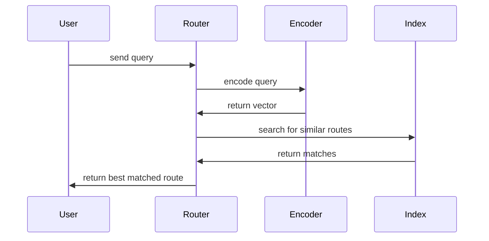
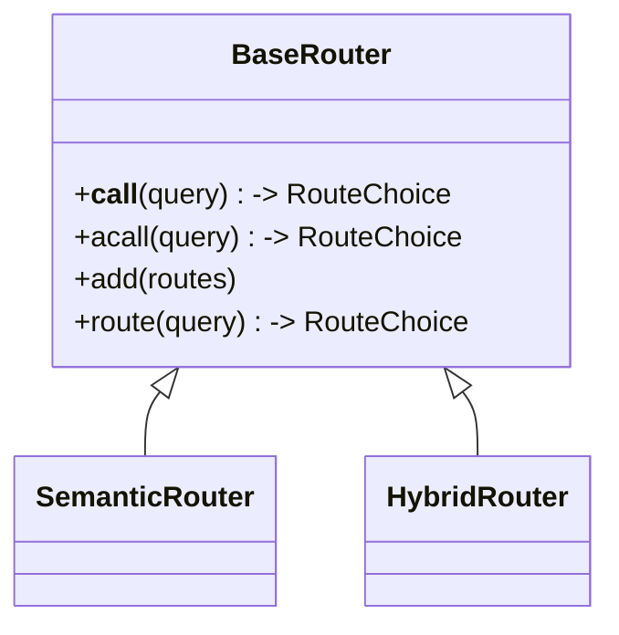

# Semantic Router: Technical Architecture

## System overview

Three components do the work. An **encoder** turns the input into a vector. An **index** stores your route vectors. A **router** compares the two and picks a match.



## Core components

### 1. Encoders

Encoders map inputs into semantic space.



- **Dense encoders** produce continuous vectors (OpenAI, Hugging Face, …).
- **Sparse encoders** produce mostly-zero vectors (BM25, TF-IDF, AurelioSparse, …).
- **Multimodal encoders** handle images as well as text (CLIP, ViT).

### 2. Routes

A route is a pattern to match, defined by example inputs that should trigger it.



- **name** — the route's identifier.
- **utterances** — example inputs that should match.
- **function_schemas** — optional. Set this and the route becomes *dynamic*, able to call functions.
- **score_threshold** — the minimum similarity needed to match.

### 3. Indexes

Indexes store route vectors and search them efficiently.



- **LocalIndex** — in-memory, dense vectors.
- **HybridLocalIndex** — in-memory, dense *and* sparse.
- **PineconeIndex / QdrantIndex** — cloud vector databases.
- **PostgresIndex** — SQL storage via pgvector.

## Data flow



1. An input arrives (text, an image).
2. The encoder turns it into a vector.
3. The router searches the index for similar route vectors.
4. The best match above threshold is selected.
5. The matched route comes back, ready for your handler.

## Router types



- **SemanticRouter** — dense embeddings, pure semantic matching.
- **HybridRouter** — dense *and* sparse, for better accuracy when exact keywords matter.

## Putting it together

```python
from semantic_router import Route, SemanticRouter
from semantic_router.encoders import OpenAIEncoder

# 1. Define routes
weather_route = Route(name="weather", utterances=["What's the weather like?"])
greeting_route = Route(name="greeting", utterances=["Hello there!", "Hi!"])

# 2. Pick an encoder
encoder = OpenAIEncoder()

# 3. Build the router
router = SemanticRouter(encoder=encoder, routes=[weather_route, greeting_route])

# 4. Route a query
result = router("What's the forecast for tomorrow?")
print(result.name)  # "weather"
```

## Performance notes

- **In-memory vs. vector DB** — pick by scale and latency needs.
- **Encoder choice** — trade accuracy against speed for your use case.
- **Batching** — use the batch methods for higher throughput.
- **Async** — available for high-concurrency and network-heavy workloads.
