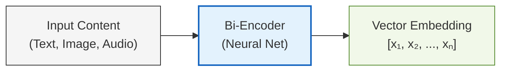
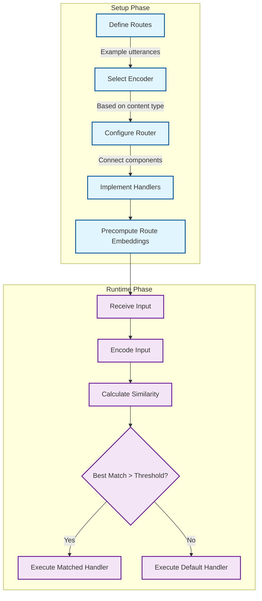

Semantic routing sends an input — text, an image, audio — to the right handler based on what it *means*, not on keywords or hand-written rules. People say the same thing a hundred different ways. Semantic routing handles that variety without you enumerating every phrasing.

## Semantic space

Here's the core idea. Imagine a huge coordinate system where every point is a concept. "I need help with my password" sits right next to "Can't log in to my account", and far from "What's the weather forecast?". That's semantic space. Meaning becomes geometry, and similarity becomes a distance you can measure.

- Each point (a vector) represents the meaning of some content.
- Distance between points is semantic difference.
- Similar meanings cluster together, whatever the exact wording.

So synonyms, paraphrases, and related ideas all land close to each other — and you never program the variations by hand.

### Encoders

To put content into semantic space, you *encode* it into a vector. That's the job of an encoder (you'll also hear "embedding model" or "bi-encoder").

An encoder takes the input, analyzes its features, and outputs a fixed-size vector of numbers — usually hundreds or thousands of dimensions. "How's the weather today?" might become `[0.12, -0.34, 0.56, ...]`. "What's the temperature outside?" becomes a different but nearby vector, because the meanings are close.

Semantic Router supports two families:

- **Dense encoders** (`OpenAIEncoder`, `HuggingFaceEncoder`, …) fill every dimension. They capture rich semantic relationships.
- **Sparse encoders** (`AurelioSparseEncoder`, `BM25Encoder`, …) leave most dimensions at zero. They excel at exact keywords and term frequency.

### Multimodal routing

Text is the common case, but anything you can encode, you can route:

- **Images.** `CLIPEncoder` and `VitEncoder` place images in the same space as text, so you can compare across modalities.
- **Audio.** Speech or sound, routed on content or tone.
- **Mixed content.** Text and images together, encoded jointly or separately.

That's what lets you route on what's *in* an image, or on the combined meaning of text plus a picture.

### Making the decision

Once everything is a vector, routing is a similarity calculation. The usual measures:

- **Cosine similarity**: cos(θ) = (A·B)/(||A||·||B||)
- **Euclidean distance**: d(A,B) = √(Σ(Aᵢ-Bᵢ)²)
- **Dot product**: A·B = Σ(Aᵢ·Bᵢ)

Semantic Router compares the incoming query against every route, where each route is represented by its example utterances. The route with the highest score above a configurable threshold wins.

## The workflow

1. **Define routes** — example utterances for each category.
2. **Pick an encoder** — based on content type and performance needs.
3. **Configure the router** — connect encoder, routes, and an index.
4. **Write handlers** — the logic for each route.
5. **Route inputs** — encode, compare, dispatch.

Semantic Router handles the vector math, the similarity scoring, and the decision. You focus on defining good routes and writing the handlers.
